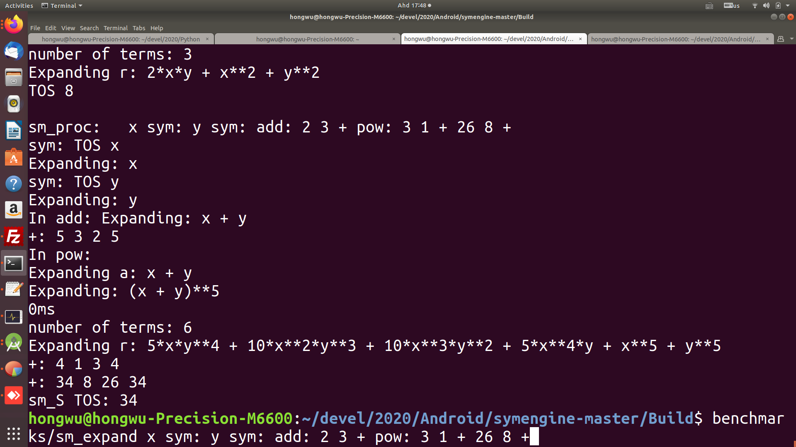

Updated code:

https://github.com/udexon/SymForth/blob/master/benchmarks/sm_expand.cpp

`std::stack<std::string> mystack;` has been renamed to:
```
std::stack<std::string> sm_S;
```

User may key in Forth like reverse polish notation at command line and obtain an expression from SymEngine.

Input:
```
$ ./sm_expand x sym: y sym: add: 2 3 + pow: 3 5 + 3 1 + 26 8 
```
Output:
```
Expanding r: 5*x*y**4 + 10*x**2*y**3 + 10*x**3*y**2 + 5*x**4*y + x**5 + y**5
```




The most significant innovation in this project is the RCP stack, which allows SymEngine objects (RCP=Reference Counted Pointers) to be stored on stack and subsequently manipulated:
```
std::stack<SymEngine::RCP<const Basic>> RCP_S;
```

From Forth perspective, this leads to "multitype stacks" where the input tokens and string output tokens are stored on a string stack, while the code manages "one stack per type", a hopefully elegant solution for integrating Forth with modern type oriented programming languages:
```
std::stack<std::string> sm_S;
```

Output text copy paste:
```
sm_proc:   x sym: y sym: add: 2 3 + pow: 3 1 + 26 8 +
sym: TOS x
Expanding: x
sym: TOS y
Expanding: y
In add: Expanding: x + y
+: 5 3 2 5
In pow: 
Expanding a: x + y
Expanding: (x + y)**5
0ms
number of terms: 6
Expanding r: 5*x*y**4 + 10*x**2*y**3 + 10*x**3*y**2 + 5*x**4*y + x**5 + y**5
+: 4 1 3 4
+: 34 8 26 34
sm_S TOS: 34
.../symengine-master/Build$ benchmarks/sm_expand x sym: y sym: add: 2 3 + pow: 3 1 + 26 8 +
```
